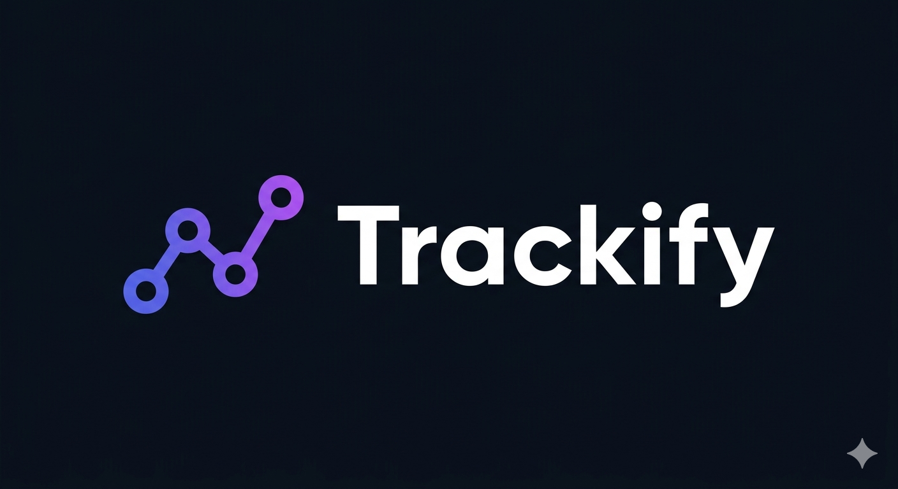

# 👨‍💻 Vinith Selvaraj
**`Java Backend Developer`**

## About Me
- I build scalable backends with Java, Spring Boot, and Microservices.
- Currently interning as a Java Backend Developer at Mentor Bridge, Dindigul.
- Passionate about designing and developing reliable, scalable, and high-performance applications.

## Skill Stack

**Also comfortable with**: Microservices, REST APIs, Spring Security, JWT, Mockito, Swagger, HTML, CSS

---

## Projects - Showcase

<table>
  <tr>
    <td align="center" valign="top" width="33%">
      
        
      <i>E-Commerce Website (Microservices)</i> 
      <b>Tech:</b> <code>Java</code> <code>Spring Boot</code> <code>Microservices</code> 
      <b>Highlights:</b> <code>Gemini AI</code> <code>Twilio SMS</code> <code>Cloudinary</code>  
      
    </td>
    <td align="center" valign="top" width="33%">
      
        
      <i>Transaction Management and Analytics</i> 
      <b>Tech:</b> <code>Spring Boot</code> <code>PostgreSQL</code> <code>REST APIs</code> 
      <b>Highlights:</b> <code>Spring Security</code> <code>JWT RBAC</code> <code>Swagger</code>  
      
    </td>
    <td align="center" valign="top" width="33%">
      
        
      <i>Real-Time Monitoring & AI Diagnostics System</i> 
      <b>Tech:</b> <code>Spring Boot</code> <code>JavaMail</code> <code>APIs</code> 
      <b>Highlights:</b> <code>Gemini AI Logs</code> <code>Twilio Alerts</code>  
      
    </td>
  </tr>
  <tr>
    <td align="center" valign="top" width="33%">
      
        
      <i>Multi-User PG Management System</i> 
      <b>Tech:</b> <code>Spring Boot</code> <code>REST APIs</code> 
      <b>Highlights:</b> <code>JWT Auth</code> <code>Twilio Automations</code>  
      
    </td>
    <td align="center" valign="top" width="33%">
      
        
      <i>Task Tracking Platform</i> 
      <b>Tech:</b> <code>Spring Boot</code> <code>PostgreSQL</code> <code>REST APIs</code> 
      <b>Highlights:</b> <code>Status Tracking</code> <code>User Assignment</code>  
      
    </td>
    <td align="center" valign="top" width="33%"></td>
  </tr>
</table>

---

## 🤝 Connect with Me

